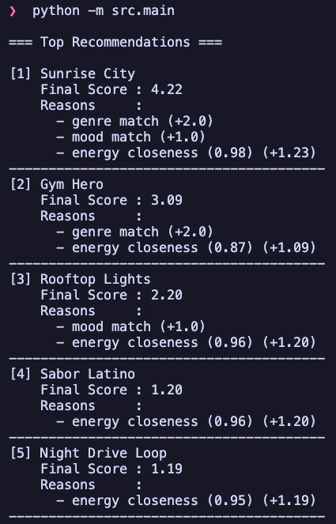

# 🎵 Music Recommender Simulation

## Project Summary

I built a small content-based music recommender that scores each song against a user profile and returns the top matches. I tested it with normal and adversarial profiles to see how weight changes affect results. The project helped me understand that simple scoring rules can feel smart, but they can also create bias if one feature is weighted too heavily.

---

## How The System Works

This is a content-based recommender, so it compares each song's features to the user's taste profile instead of looking at what other people liked.

The system uses these song features:
- Genre and mood as categorical signals
- Energy as the main numeric signal used in scoring

The user profile stores:
- Favorite genre
- Favorite mood
- Target energy

Algorithm recipe:
1. Read one song from the CSV.
2. Compare it with the user profile.
3. Add points for exact matches in genre and mood.
4. Add energy similarity points, where closer to target energy scores higher.
5. Sum the points into one total score for that song.
6. Repeat for every song in the file.
7. Sort all songs from highest score to lowest score.
8. Return the top k recommendations.

Baseline scoring (original design):
- Genre match: +2.0
- Mood match: +1.0
- Energy closeness: +1.25 × similarity

Weight-shift experiment (later test):
- Genre match: +1.0
- Mood match: +1.0
- Energy closeness: +2.50 × similarity

Potential bias:
- In the baseline version, it can over-prioritize genre.
- In the weight-shift experiment, it can over-prioritize energy and keep surfacing high-energy songs across different profiles.
- The catalog is small, so underrepresented genres get weaker results.

---

## Getting Started

### Setup

1. Create a virtual environment (optional but recommended):

   ```bash
   python -m venv .venv
   source .venv/bin/activate      # Mac or Linux
   .venv\Scripts\activate         # Windows

2. Install dependencies

```bash
pip install -r requirements.txt
```

3. Run the app:

```bash
python -m src.main
```

### Example Terminal Output



### Profile Recommendation Outputs

#### High-Energy Pop


#### Chill Lofi


#### Deep Intense Rock


#### Three Adversarial / Edge Case Profiles


### Running Tests

Run the starter tests with:

```bash
pytest
```

You can add more tests in `tests/test_recommender.py`.

---

## Experiments You Tried

I tested six profiles: High-Energy Pop, Chill Lofi, Deep Intense Rock, Conflicting Vibe, Sparse Preference, and Out-of-Range Energy.
Core profiles mostly behaved as expected (for example, Chill Lofi returned Library Rain and Midnight Coding).
The biggest experiment was a weight shift: I halved genre and doubled energy.
After that change, results became more energy-driven, and songs like Gym Hero appeared more often across different profile types.

---

## Limitations and Risks

- It only works on a tiny catalog (18 songs).
- It does not model lyrics, context, or listening history.
- It uses exact genre/mood matching, so similar tastes (like pop vs indie pop) are not handled softly.
- With the weight shift, energy can dominate and reduce diversity in top results.

---

## Reflection

My biggest learning was seeing how one weight change can reorder the whole top list. AI tools helped me code and test faster, but I still had to double-check outputs and make sure the recommendations made sense for each profile. I was surprised that a simple point system could still feel like a real recommender. If I continue this project, I would add more preference features and a diversity rule so results are less dominated by one signal.


---

